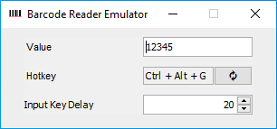

# 

A Java 11 Windows desktop app. Emulates a barcode reader device (which behaves like a keyboard).
Triggers barcode 'reading' with a hotkey event which can be configured.

## Usage

- Download the latest release and unzip the archive. 
- Run `emulator.exe`.
- Optionally, you can change the settings.
    - To change a hotkey combination, just click on the read-only hotkey text field and type in the new combination. The new combination should appear as the text field updated value. Then click on the 'refresh' button to apply the change. Keep in mind that lots of combinations are already bind and cannot be used.
    - You can also parse an existing barcode on the screen by clicking on the 'photo' button and capture a screen area with the barcode image. It will be automatically parsed and set to the 'Value' field.
- Just go to the target place (standalone app, browser tab or any other) which you are going to test with a barcode input.
- Press the hotkey.

## Screenshot

## Known issues/limitations

The list of characters supported for now (as generally the majority of barcode scanners support only basic characters):

| Characters  |
| ------------- |
| 0-9  |
| a-z  |
| A-Z  |
| \`~!@#$%^&*()_+-=&sol;;',.&bsol;:"<>? |

Also, the _US keyboard layout_ should be used (switch to it in the settings).
