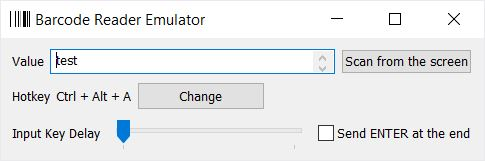

# Barcode reader emulator

[](https://oxcafedead.github.io/barcode-reader-emulator/)

Standalone Windows desktop app that emulates a barcode-reader device (acts like a keyboard). It triggers a barcode "read" when a configurable hotkey is pressed.

## Usage

- Download the executable from the latest [release](https://github.com/oxcafedead/barcode-reader-emulator/releases). 
- Run it.
- (Optional) Change the settings:
    - To change the hotkey, click the "Change" button next to the Hotkey field. Select the keys for the new combination (you can select multiple special keys). Note that some combinations are already bound by the system and cannot be used.
    - To parse an existing barcode on the screen, click the "Scan from the screen" button. The screen will be scanned automatically and the result placed into the "Value" field.
- Go to the target application (standalone app, browser tab, or any other place) where you want to test barcode input.
- Press the hotkey.

### To use the program from the command line:

```
barcode-reader-emulator.exe -value "123456" -delay 50 -sendEnter -beep=false
```

## Screenshot


## Known issues/limitations

Supported characters (most barcode scanners only support basic characters):

| Characters  |
| ------------- |
| 0-9  |
| a-z  |
| A-Z  |
| \`~!@#$%^&*()_+-=&sol;;',.&bsol;:"<>? |

Use the _US keyboard layout_ (switch to it in Windows settings).

Only Windows is supported at this time.

## Support
[](https://www.buymeacoffee.com/vozhdaenko)

## Build
First, install Go.\
Then install all dependencies, do:
```cmd
go install
staticcheck
go test
```
Install binaries of the rsrc:
```cmd
go install github.com/akavel/rsrc@latest
```
Then run:
```
.\build.bat
```
